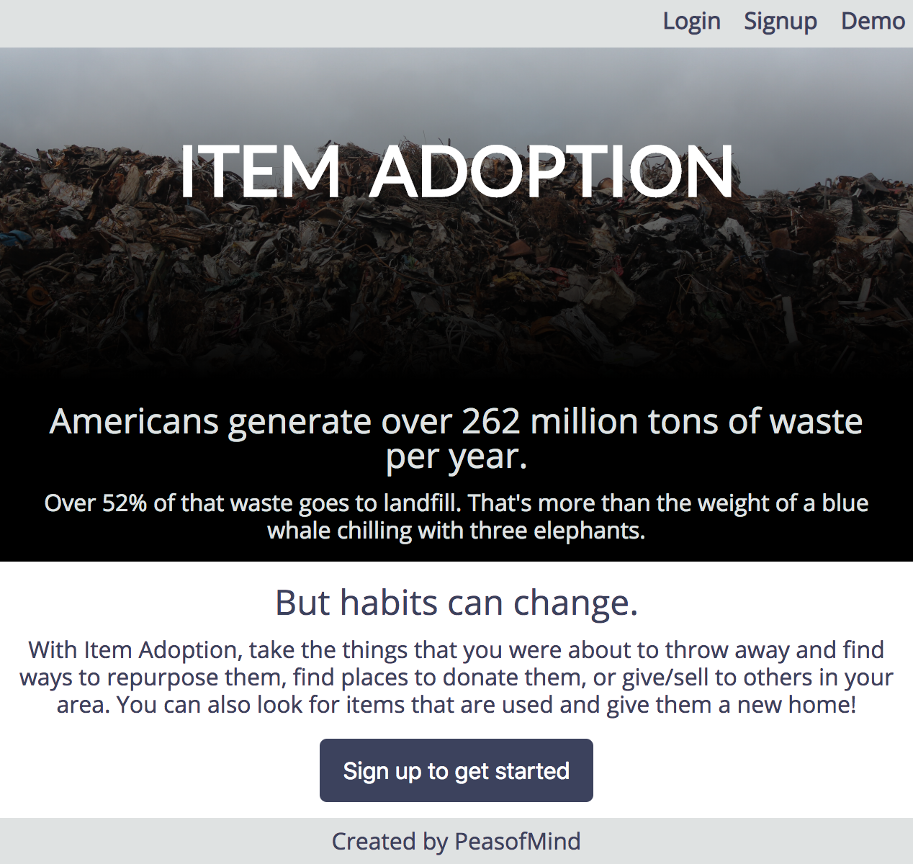
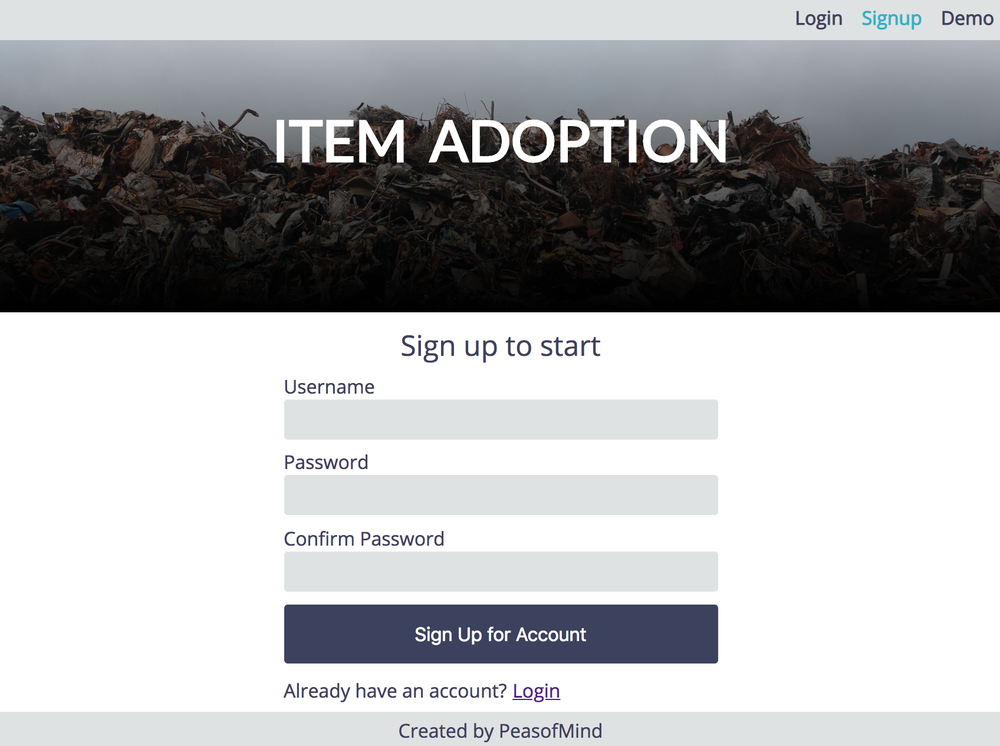
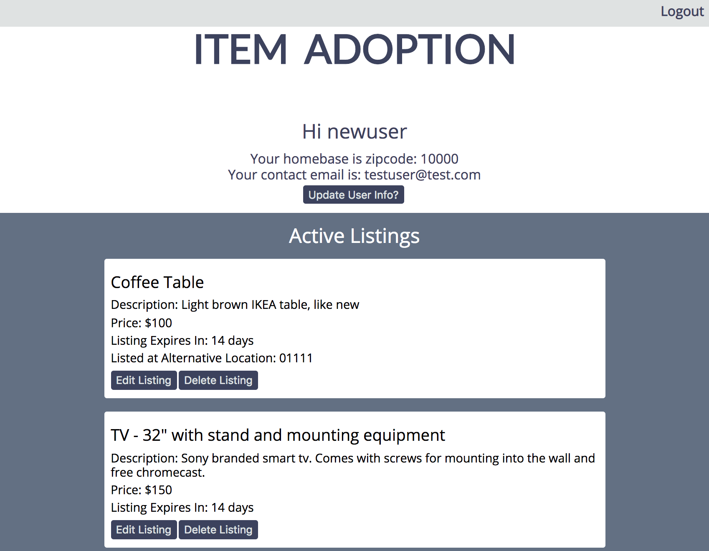
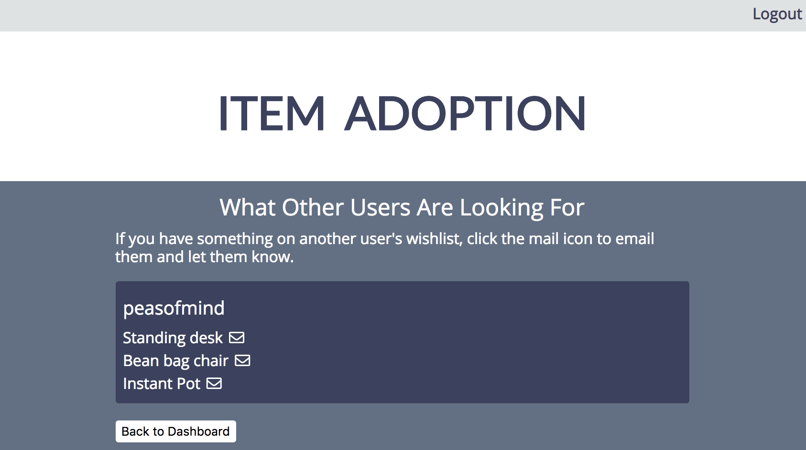
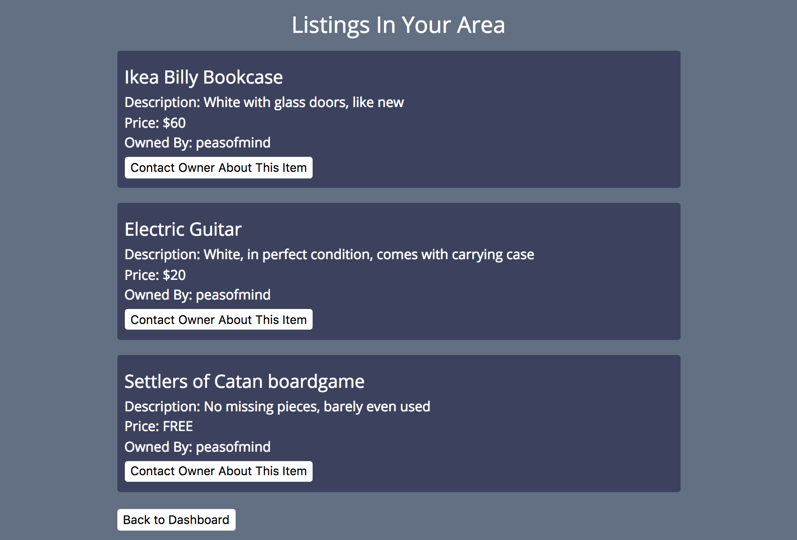

# Item Adoption

Item Adoption is an app to help users connect with others in their area to sell/give away things that are no longer useful to them or to buy/get things from other users that they want.

Each user is able to create a wishlist of things they want to have or create listings for the items they want to sell or give away. Users can view other listings or wishlists posted in their area and contact other users about those posts.

A demo account is available to test the account in the navigation bar.

The live app can be accessed at: https://pacific-savannah-70762.herokuapp.com/

API code: https://github.com/PeasOfMind/item-adoption-api

This project was bootstrapped with [Create React App](https://github.com/facebook/create-react-app).

## Screenshots

### Landing Page:
Users can navigate to login, signup, or access the demo account on the navigation bar or to signup at the bottom of the page.

### Signup Page:
Users can sign up to create a new account or switch over to the login page to access an existing account.

### Dashboard:
The dashboard shows the user's active listings and when they expire. If a listing will expire within 5 days, a renew button will appear under the listing so the user can set the expiration back to 14 days.

Users can also create a listing at an location different from their homebase zipcode.

Listings or wishlists cannot be created without the user zipcode and email. New users will have to add this user info to continue.

Users can add to their wishlist. Wishlist items are automatically set to the user's homebase zipcode and their location cannot be changed.

### View Other Wishlists
Users can see other user wishlists in their same zipcode. An email icon next to each item will allow users to email the wishlist owner to initiate an exchange. The email is sent by the [SendGrid](https://sendgrid.com/) email service using an email template and if the email is successfully sent, a green check will appear next to the item in place of the email icon. 

### View Other Listings
Similarly, users can also other user listings in their same zipcode. A button under each item users to email the listing owner to initiate an exchange (using the SendGrid email service). If the email is sent successfully, a message will appear below the listing confirming the listing owner was contacted.

For both other wishlists and listings, the other users' emails are not directly available in the app and the exchange will only proceed if the contacted user responds to the email.

---
Built with: Javascript, React, Redux, HTML5, CSS

## Goals for Future Versions
Support a more robust search in area feature. Current version only supports exact match of zipcode.

Add ability to search for thrift shops and/or donation centers in area

